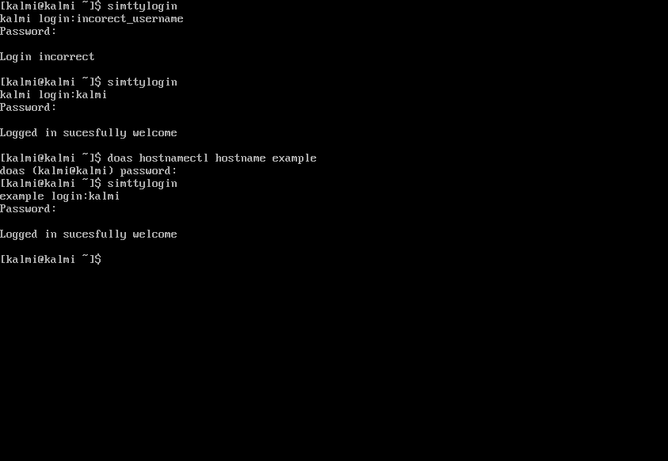

# simttylogin
`simttylogin` a program to simulate tty login in terminal
 
__Note: this program does not do a login your user won't change after a sucesfull login__
## requirements
### ubuntu,debian and distros based on these
`sudo apt update ; sudo apt install gcc pkg-config pam git`
### Arch and distros based on Arch:
`sudo pacman --needed -S gcc pkgconf pam git`
## download
`git clone https://github.com/dorker6/simttylogin ; cd simttylogin`
## compiling and installing
### one command to rule them all:
`chmod +x ./compile.sh ./install.sh; ./compile.sh ; sudo ./install.sh`
### withought root acess you can run:
`chmod +x ./compile.sh ; ./compile.sh`
then from that directory run the program:
`./simttylogin`
